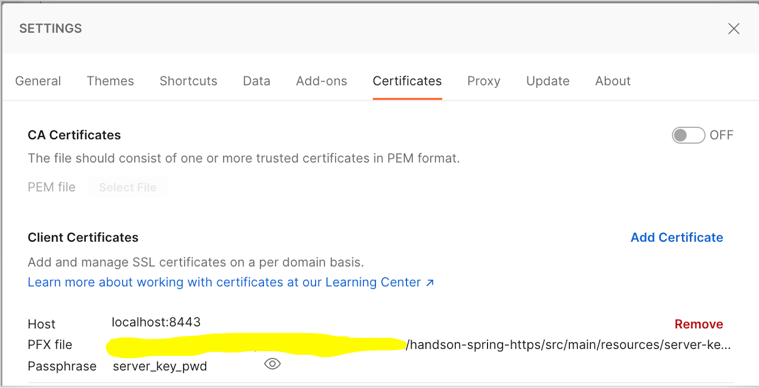

# How to test the Web API

## curl commands

> curl -k --cert-type P12 --cert src/main/resources/client-keystore.p12:client_key_pwd https://localhost:8443/keepalive
 
> curl -k --cert-type P12 --cert src/main/resources/identity.p12:identity https://localhost:8443/keepalive

> (this should not work) curl -k --cert-type P12 --cert src/main/resources/http-trust.p12:http-trust https://localhost:8443/keepalive

## Postman

1. import postman from `companion/postman/SpringBoot.postman_collection.json`

2. Add the `identity.p12` in settings/certificates as can be seen in the picture below. For pwd see `src/main/resources/application.yml`

